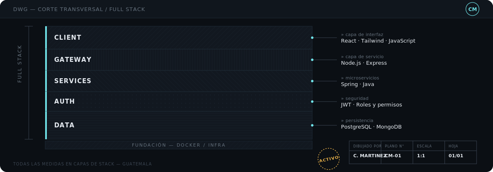

 

 

 

 

> No me interesa solo que la pantalla se vea bien. Me interesa lo que pasa detrás: cómo se autentica un usuario, quién tiene permiso de hacer qué, y cómo conversan los servicios entre sí.

Estudiante de desarrollo de software enfocado en aplicaciones **full stack** completas: interfaces en React, servicios en Node.js y Spring, y los datos que los sostienen en PostgreSQL y MongoDB. Actualmente en desarrollo constante de una app en React Native, y aprendiendo microservicios, Docker y buenas prácticas de backend a cada proyecto que entrega.

 

 

<table width="100%">
<tr>
<td width="25%" valign="top">

 interfaz

</td>
<td width="25%" valign="top">

 servicios

</td>
<td width="25%" valign="top">

 persistencia

</td>
<td width="25%" valign="top">

 herramientas

</td>
</tr>
</table>

 

 

> 
>
> ### Kinal Gourmet House
>
> Sistema de gestión de restaurante desarrollado en equipo, con autenticación JWT, roles diferenciados por tipo de usuario y una API REST completa sobre Docker y PostgreSQL.
>
> 
> 
> 
> 
>
> **[Ver repositorio ↗](https://github.com/cmartinez-2024032/Kinal-Gourmet)**

 

> 
>
> ### GestorDeOpiniones
>
> API backend para la gestión de opiniones, con autenticación mediante JWT, variables de entorno configurables y persistencia en PostgreSQL.
>
> 
> 
> 
>
> **[Ver repositorio ↗](https://github.com/cmartinez-2024032/GestorDeOpiniones)**

 

> 
>
> ### AuthService
>
> Microservicio de autenticación containerizado con Docker Compose y base de datos PostgreSQL, construido para un sistema de gestión deportiva.
>
> 
> 
> 
>
> **[Ver repositorio ↗](https://github.com/cmartinez-2024032/AuthService)**

 

 

  

  

 

 

